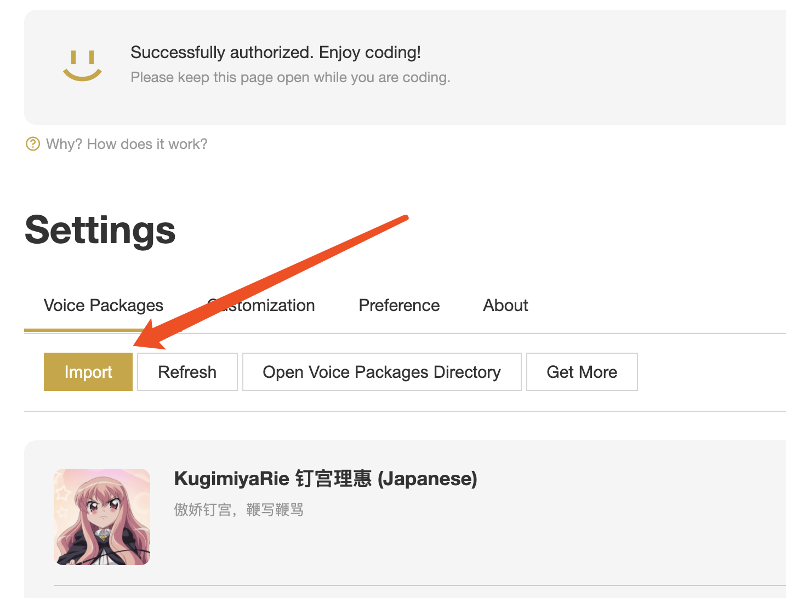
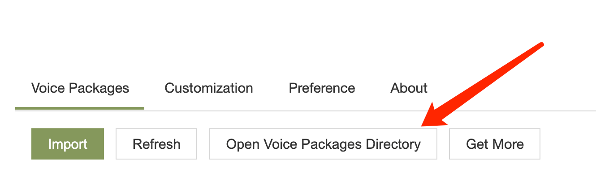

<h1 align="center">
钉宫 ⭐️ rainbow-fart ⭐️ 语音包
</h1>

<p align="center">
  <a href="https://github.com/SaekiRaku/vscode-rainbow-fart" target="_blank" rel="noopener noreferrer"></a>
  <a href="https://github.com/zthxxx/kugimiya-rainbow-fart/releases" target="_blank" rel="noopener noreferrer"></a>
  <a href="https://github.com/zthxxx/kugimiya-rainbow-fart/blob/master/LICENSE" target="_blank" rel="noopener noreferrer"></a>
</p>

<p align="center">
<strong>「 哪个男孩能拒绝一个傲娇萝莉纸片人老婆在一旁鞭写鞭骂呢？ 」</strong>
</p>

---

这是一个 vscode 彩虹屁🌈插件 [vscode-rainbow-fart](https://github.com/SaekiRaku/vscode-rainbow-fart) 的语音扩展包，灵感来源 [#40](https://github.com/SaekiRaku/vscode-rainbow-fart/issues/40) (支持 `JS` `TS` `python` `golang`)

但这并不彩虹屁，因为钉宫没有夸你，**相反是在骂你**；  ~~你再骂？！(恳求)~~

但是从作用上说又并没有区别，彩虹屁原理是让人听着舒服、心情愉悦有动力写代码，

而钉宫傲娇的声音同样听得眯眼而且非常激动、~~血压飙升~~码力十足。


## Preview


语音文件: [voices/](./voices/)

语音台词对照: [resource.csv](./resource.csv)

关键词语音列表: [keywords-voices.yml](./keywords-voices.yml)


## Install

在 vscode-rainbow-fart(v1.2.3) 中引入语音包是需要打包成 zip 然后引用的，

**本项目已经提供了打包好的文件，可以直接在 [Releases](https://github.com/zthxxx/kugimiya-rainbow-fart/releases) 中下载最新版 zip；**

(或者作为开发者从[本仓库](https://github.com/zthxxx/kugimiya-rainbow-fart) clone 后自己手动把相关资源打包成 zip (`npm run build`)。)

然后在本地 vscode 启动的 rainbow-fart 配置页面中 `Settings` -> `Voice Packages` -> `Import` 中导入 zip，导入后需要点 enable 开关开启使用；




## Customize

导入后可以在页面上打开音频文件夹然后编辑 `manifest.json` 来简单自定义**修改触发关键词和语音**，

语音台词对照已整理了列表清单，参见 [resource.csv](./resource.csv)，方便在自定义时选择让自己~~-兴奋-~~喜欢的语音；

如果觉得触发太频繁可以手动删掉一些关键词，或者**把某些关键词改成错误拼写** (目前内置了一些常见 typo)，**立即享受在打错单词的时候被钉宫狠狠的骂一顿吧～**




## Dev & Contribute

目前[关键词和语音](./keywords-voices.yml)意思不太对应，希望众钉宫病患者厨力放出，完善一下语音和对应关键词，让钉宫骂得更爽一点。

切分的语音全都放在 [voices/](./voices/) 目录下了，语音和**对应台词及翻译**有对照清单 [resource.csv](./resource.csv)，方便各位自由发挥。

开发时对于触发关键词的调♂教只需要改 [keywords-voices.yml](./keywords-voices.yml) 文件，

因为拆分了关键词和语音配置，所以做了一些打包流程，依赖 nodejs；

常规本地构建 (打包产出在 `./dist/` 中)：

```bash
npm ci
npm run build
```

## Ref

- [vscode-rainbow-fart](https://github.com/SaekiRaku/vscode-rainbow-fart)
- [语音合集来源](https://music.163.com/song?id=426850381)
- [钉宫理惠 - 萌娘百科 万物皆可萌的百科全书](https://zh.moegirl.org/zh-hans/%E9%92%89%E5%AE%AB%E7%90%86%E6%83%A0)

(最后放一张镇楼图)


## Author

**kugimiya-rainbow-fart** © [zthxxx](https://github.com/zthxxx), Released under the **[MIT](./LICENSE)** License.<br>

> Blog [@zthxxx](https://blog.zthxxx.me) · GitHub [@zthxxx](https://github.com/zthxxx)
