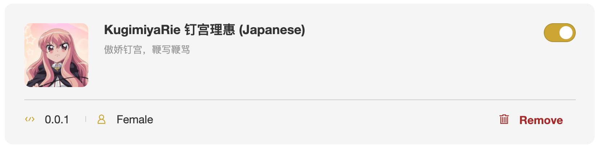
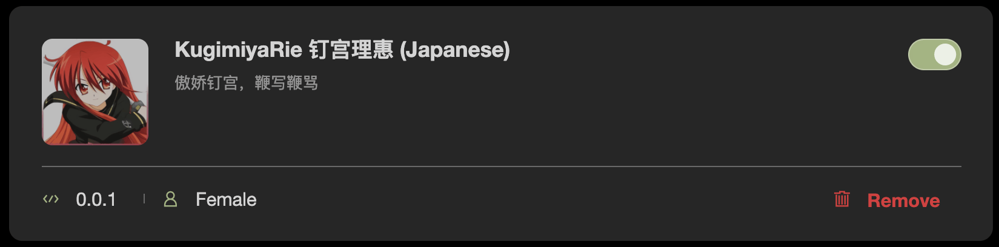

# 钉宫 rainbow-fart 语音包

> 哪个男孩能拒绝一个傲娇萝莉纸片人老婆在一旁鞭写鞭骂呢？

这是一个 vscode 彩虹屁🌈插件 [vscode-rainbow-fart](https://github.com/SaekiRaku/vscode-rainbow-fart) 的语音扩展包，灵感来源 [issue#40](https://github.com/SaekiRaku/vscode-rainbow-fart/issues/40)

但这不是彩虹屁，因为钉宫并没有夸你，相反是在骂你；

但是从作用并没有区别，彩虹屁原理是让人听着舒服 心情愉悦有动力写代码，

而钉宫的傲娇声音同样听着舒服而且非常激动，码力十足。

「 你再骂？！(恳求) 」

## Preview

## Install

从[本仓库](https://github.com/zthxxx/kugimiya-rainbow-fart/) clone 后自己打包，或者直接在 [Releases](https://github.com/zthxxx/kugimiya-rainbow-fart/releases) 中下载最新版

## Contribute

目前关键词和语音 意很不希望众钉宫病患者厨力放出，完善一下语音和对应关键词，让钉宫骂得更爽一点

## Ref

基于官方 `Built-In Voice (Chinese)` 替换 keywords 对应音频

感谢 [@moonlitht](https://github.com/moonlitht) 提供[切分的音频文件](https://github.com/SaekiRaku/vscode-rainbow-fart/issues/40#issuecomment-647021980)
